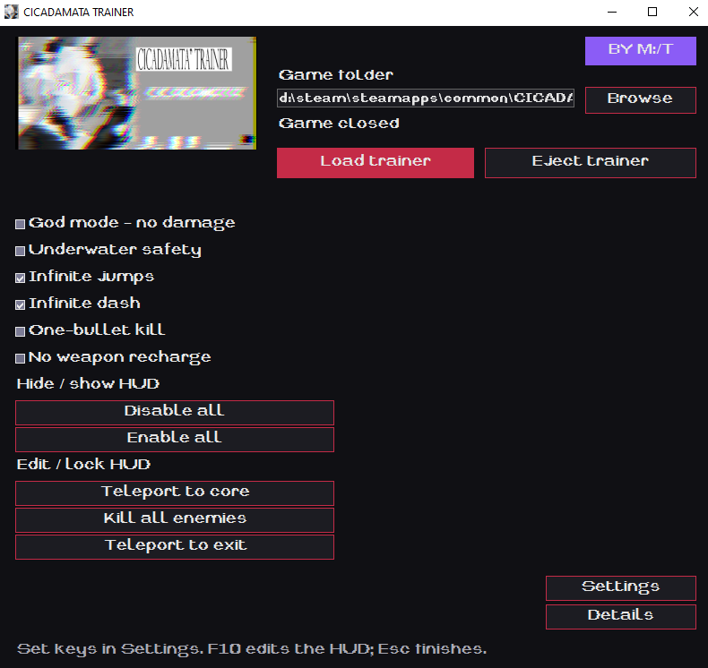

# CICADAMATA Trainer (+13)

Trainer by [M:/Tofi4](https://met0fi.github.io/Siteportfoliomt/). Windows application with 13 controls, custom key binds and an in-game menu.



## Installation

1. Download [CicadamataTrainerBYMET100.zip](https://github.com/Met0fi/CicadamataTrainer/releases/latest) from Releases and unpack it into any folder.
2. Run `CicadamataTrainer.exe`. Requires .NET Desktop Runtime 8 for Windows.
3. Check the detected game path. If it is missing or incorrect, click **Browse** and select the game folder.
4. Launch the game, then click **Load trainer**. The game restarts with the trainer loaded.
5. Use the application buttons, assigned keys or the in-game menu.

Click **Eject trainer** to remove the installed trainer files. If the game is running, it restarts without the trainer. Loading or ejecting restarts the game, so finish your current run first.

## Controls

| Default key | Function |
| --- | --- |
| F1 | God mode |
| F2 | Underwater safety |
| F3 | Infinite jumps |
| F4 | Infinite dash |
| F5 | One-bullet kill |
| F6 | No weapon recharge |
| F7 | Hide / show HUD |
| F8 | Disable all |
| F9 | Enable all |
| F10 | Edit / lock HUD |
| F11 | Teleport to core |
| F12 | Kill all enemies |
| End | Teleport to level exit |

These functions are also available in the EXE application. Press **Esc** to finish editing the HUD.

## Binds

Open **Settings**, click **CLICK ON ME** next to a function and press the key you want to use. **Esc** cancels key capture.

## Antivirus behavior

The trainer loads a Godot script into the game, which may trigger antivirus detections. Check the downloaded archive before running it. A detection count alone does not prove that a file is safe.

## Source and build

`trainer/` contains the C# Windows application and its embedded resources. `mod/cicada_trainer.gd` contains the game-side trainer. The release ZIP is supplied separately under Releases.

Build on Windows with .NET SDK 8:

```powershell
dotnet publish trainer/CicadamataTrainer.csproj -c Release -r win-x64 --self-contained false -p:PublishSingleFile=true -o dist
```

Run the Godot script tests with PowerShell:

```powershell
pwsh tools/run-tests.ps1
```

The test script downloads Godot 4.7.2 if it is not already present in `tools/godot/`.
